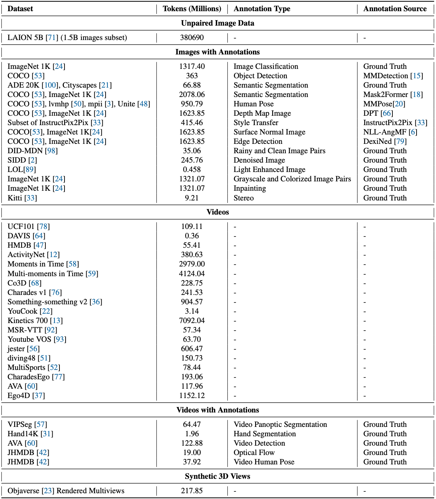
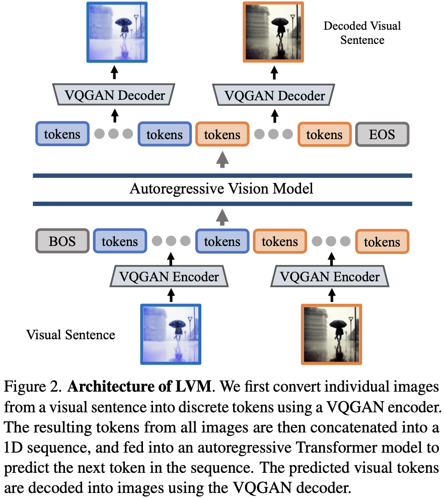
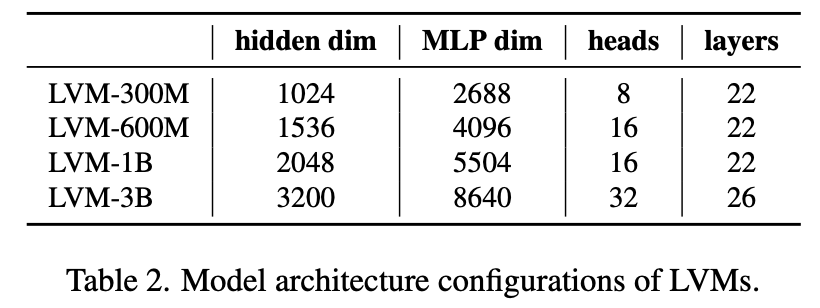
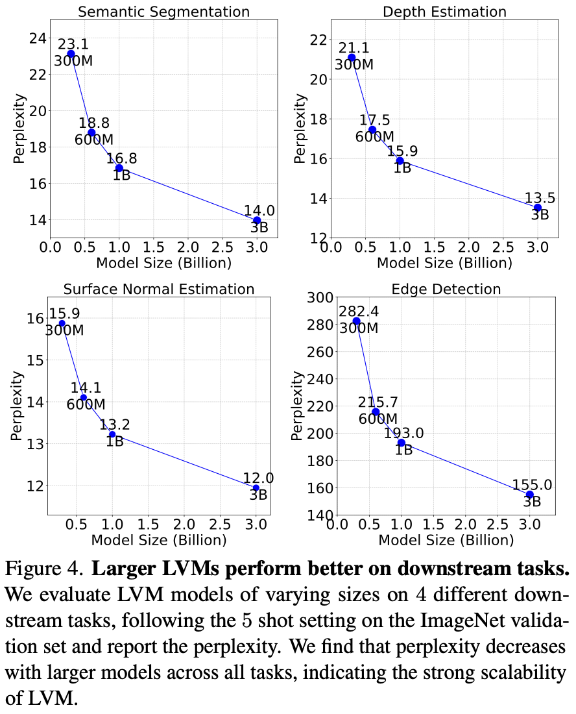
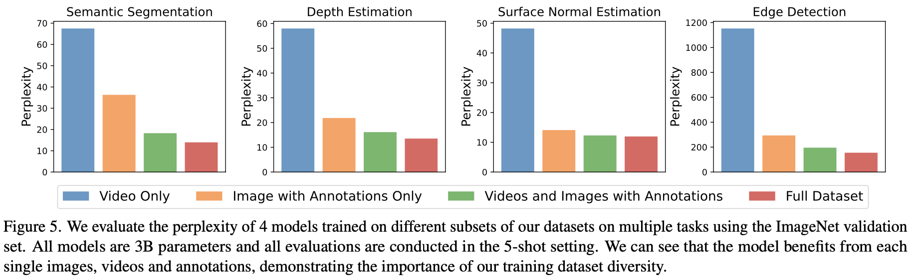
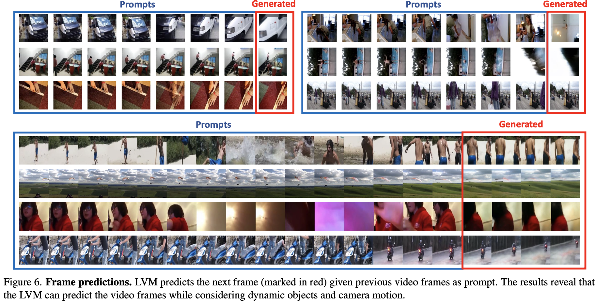
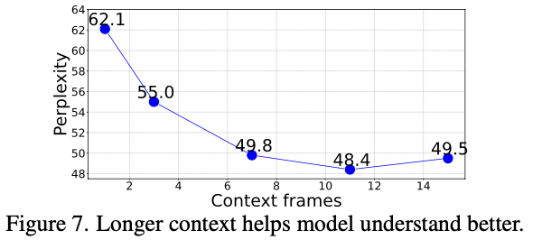
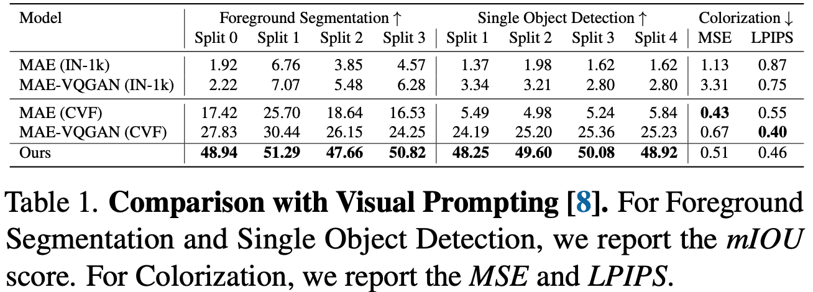
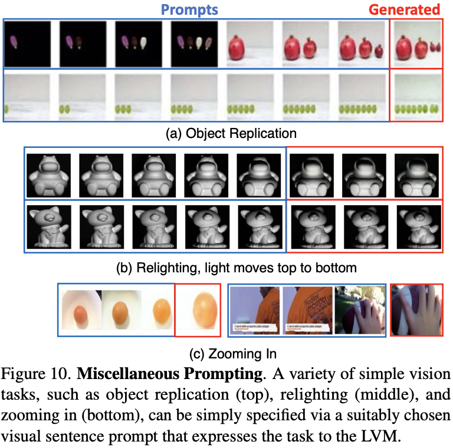

# [论文笔记] LVM: 纯视觉的通用大模型, CV的GPT时刻? Sequential Modeling Enables Scalable Learning for Large Vision Models 论文精读

Author: <a href="https://yusijin02.github.io/">Sijin Yu</a>

> **导读**
>
> 大语言模型无疑是2023年最大的热点之一. 当前, 包括视觉在内的几乎所有方向, 人们都热衷于加入语言的引导. 在此背景下, 一篇纯视觉的大模型无疑吸引人眼球. 该模型吸取大语言模型的成功经验, 创新性地定义了**视觉句子**, 并几乎抛弃了此前 CV 的所有训练任务, 仿照大语言模型, 使用**序列自回归**任务训练视觉模型, 并**统一了几乎所有的视觉任务**. 虽然该模型在下游任务中还不能超越对应任务的 SOTA, 但是这一新颖的方案为接下来的研究提供了大量思路, 称之为又一**开山之作**毫不为过.
>
> **论文信息**:
>
> - 标题: Sequential Modeling Enables Scalable Learning for Large Vision Models
> - arXiv: https://arxiv.org/abs/2312.00785
> - GitHub: https://github.com/ytongbai/LVM (但代码还未开源)
>
> 该论文发表于2023年12月1日, 本博客作于2023年12月7日.

[TOC]

## 0. Abstract

- 我们提出了一种新颖的序列建模方法, 该方法能够在**不使用任何语言数据**的情况下学习大视觉模型 (Large Vision Model, LVM).
- 为了做到这一点, 我们定义了一种通用格式——“视觉句子” (visual sentences), 在这种格式中, 我们可以表示原始图像和视频, 以及语义分割和深度重建等带注释的数据源, 而**无需超越像素层面的任何元知识**.
- 这种多样化的视觉数据 (包含4200亿个标记) 被表示为序列后, 就可以训练模型来最小化交叉熵损失, 以预测下一个标记.
- 通过在不同规模的模型架构和数据多样性上进行训练, 我们提供了实证证据, 证明我们的模型可以有效地扩展.
- 在测试时设计合适的视觉提示, 可以解决许多不同的视觉任务.

## 1. Introduction

### 1.1 Motivation

- 以 GPT 和 LLaMA 为代表的大语言模型震惊世人, 但现在还没有大视觉模型 (LVM).
- 在动物的世界中, 视觉这一概念并不依赖于语言, 但是许多实验证明, 非人类灵长类动物的视觉和人类非常相似.
- 因此, 纯视觉、无语言的大模型是完全可能的.

### 1.2 Contribution

本文参考了 LLM 的成功经验, 在以下三个方面做出了努力:

- **数据 (Data)**: 利用了过去几十年中产生的各类带标注的视觉数据源 (包括: 语义分割、深度重建、关键点、3D物体的多视图等), 并且为这些数据**定义了一种通用的格式**, 即**视觉句子 (Visual Sentences)**, 而不需要任何超越像素层面的知识, 训练集总规模为16.4亿张图像 (帧).
- **架构 (Architecture)**: 使用 3-billion 参数的 Transformer 架构. 每张图像映射到 256 个向量量化的 tokens 组成的串.
- **损失函数 (Loss Function)**: 参考了自然语言社区的解决方案, 抛弃“完形填空”的 masked token modeling 任务, 采用 GPT 系的预测下一个 token, 即**序列自回归预测 (sequential autoregressive prediction)**. 训练模型以最小化预测下一个 token 的交叉熵损失.

### 1.3 Findings

借助上述的设计, 发现了一些值得注意的有趣行为:

- 随着模型规模和数据量增加, 展现出适当的规模化行为.
- 不同的视觉任务可以在测试时设计合适的提示来解决, 但结果不像为特定任务训练的定制模型那样高性能.
- 大量无监督数据对各种标准视觉任务性能有明显益处.
- 模型略微具有处理超出分布的数据的视觉推理能力.

## 2. Related Work

- **预训练视觉模型 (Pretrained Vision Models)**. 自2015年起, 预训练视觉模型 (如 ImageNet 预训练的AlexNet) 在计算机视觉领域已成标准实践, 但尽管 Transformer 架构带来进步, 这些模型在处理极大数据集 (如 LAION) 时仍面临挑战.
- **多任务学习和上下文学习 (Multi-task Learning and In-context Learning)**. 计算机视觉正从传统的单模型单任务设置逐渐转向一个模型执行多个不同任务. 虽然存在多种多任务学习方法, 但它们通常局限于固定的、预定义的任务数量. 最近, 人们**受大型语言模型中上下文学习启发的方法放弃了任务的概念**, 而是直接从输入提示中推断任务. 例如, 视觉提示在测试时接收任务输入/输出示例对和查询图像, 将它们合并成一个 2x2 的图像, 并使用修补技术生成所需输出. 然而, 由于这种修补使用了MAE的变体, 这些方法也继承了相同的规模扩展问题.
- **自回归视觉模型 (Auto-regressive Visual Models)**. 自回归视觉模型的应用可以追溯至70年前, 最初灵感来源于香农对N-gram语言合成的使用. 随着深度学习模型的兴起, 新的研究用 RNN 或 CNN 替代 N-gram 进行像素合成. 最近, 基于 Transformer 的自回归视觉生成方法被提出, 并在结合语言方面展示了令人印象深刻的图像合成效果.

## 3. Data

> *“Data! Data! Data! I can’t make bricks without clay!”*

本工作尝试像语言模型一样, 提出一个包含多种任务的通用的数据集, 称为**统一视觉数据集v1 (Unified Vision Dataset v1, UVDv1)**. 包含: (1) 未标记的图像, (2) 带视觉注释的图像, (3) 未标记的视频, (4) 带视觉注释的视频, (5) 3D合成对象. 这些数据不包含非视觉的数据 (如文本). UVDv1 包含16.4亿张图像.

语言数据具有一个自然的、统一的一维结构, 但是视觉数据并非如此. 这项工作提出, **将视觉句子 (Visual Sentences) 作为视觉数据的统一单元**. 简单来说, 一个视觉句子包含一个或多个图像的序列, 后面跟着一个句子结束标记 (EOS).

- **单张图片 (Single images)**. 视觉句子中的最简单形式: {图像, EOS}. 这里使用了从 LAION 5B 数据集中筛选的14.9亿上图片, 占本工作数据的 88.5%.

- **图像序列 (Image sequences)**. 这里占本工作的数据的 4.24%.

  - 从现有的视频数据集中获取视频数据, 并采用三种不同的步幅 (10, 20, 30) 随机下采样视频, 形成16帧的视觉句子.

  - 利用来自 Objaverse 数据集合成的3D对象, 生成一对象为中心的多视角序列, 涵盖各种对象. 从1.5到2.2之间采样一个半径长度, 从-45度到45度之间采样一个恒定的仰角, 以15度的步长便利对象的不同视图, 渲染24个视图, 总共生成了42000个训练序列和8000个测试序列.

  - 使用来自 ImageNet 的类别, 将相同类别的图像组合在一起, 形成一个16帧的视觉句子.

- **带标注的图像 (Images with annotations)**. 这里占本工作数据量的 7.15%. 为了以统一的方式处理不同类型的图像注释, **将所有注释表示为图像**. 一些任务的数据类型其实已采用这种表示, 如语义分割图、边缘图、深度图、法线图. 对于其它的注释类型:

  - **目标检测**: 在每个目标周围叠加带有颜色编码的边界框来创建注释. (遵循 [15])
  - **人体姿势**: 人体骨架以像素空间中的 OpenPose 格式呈现, 利用 MMPose. (遵循 [20])
  - **深度估计**、**表面法线**、**边缘检测**: 基于 ImageNet 和 COCO 图像. (遵循 [55])
  - **风格迁移**、**去雨**、**去噪**、**低光增强**、**立体数据集**: 表示为图像对 (输入-输出).
  - **着色**: 将 ImageNet 对图像转换为灰度图像, 生成图像对.
  - **补全**: 在图像中随机添加黑色框, 产生图像对.

  对于上述所有注释类型, 可以用下面方法产生视觉句子:

  - 将相同注释类型的 8 个图像对连接在一起形成 16 个图像对视觉句子.
  - 对于包含相同图像对 $k$ 个不同注释的数据集, 对每组 $1+k$ 个图像 (输入+$k$ 个输出), 随机选择 $m$ 个元素, $m\leq n+1\leq16$, $n$ 是被选择的输出数, 将这些 $m$ 元组连接起来形成视觉序列.

- **带标注的图像序列 (Image sequences with annotations)**. 占数据量 0.06%. 采用两种互补策略:

  - {frame1, annot1, frame2, annot2, ...}
  - {frame1, frame2, annot1, annot2, ...}

数据的详细构成如下表所示.

## 4. Approach

训练分为两个阶段: 

- 训练一个大型的视觉标记器 (visual tokenizer), 它操作于单个图像上, 将图像转换成一系列视觉词元 (token).
- 训练一个自回归的 Transformer 模型, 每个视觉句子都表示为一系列的的词元 (token).

### 4.1 Image Tokenization

- 在一个图像内, 我们并没有自然的序列结构. 先前的做法有两种: (1) 像 ViT 一样将图像打成 patches, 并将它们当作序列; (2) 使用预训练的 image tokenizer, 例如 VQVAE 和 VQGAN, 将图像的特征提取为离散的 tokens 网格, 并将它们当作序列.

  本工作采用后者, 因为模型离散类别的输出自然地形成了一个概率分布, 这可以更方便的在视觉句子中条件生成新图像时采样.

- 本文使用 VQGAN 生成 tokens. VQGAN 由 Encoder 和 Decoder 组成, 给定一个图像, VQGAN tokenizer 产生 256 个离散的 tokens.

- 值得注意的是, VQGAN tokenizer 独立地在各个图像上操作, 而不是以证词在整个视觉句子上操作. 这种独立性使 tokenizer 的训练与下游的 Transformer 模型分开, 使得 tokenizer 可以在单个图像的数据集上进行训练, 而不必考虑视觉句子的分布.

**实现细节**: downsampling factor 为 $f=16$, codebook size 为 $8192$. 实验发现在 ImageNet 上预训练的 tokenizer 不能泛化到数据集以外, 因此在 LAION 5B 数据集上的 1.5B 子集上预训练.

### 4.2 Sequence Modeling of Visual Sentences

将图像转换为 VQGAN 的离散 tokens 后, 将多个图像的离散 tokens 连接成一维序列, 将视觉句子视为统一序列. **所有的句子都被平等的对待, 不使用任何特殊 tokens 来特定任务或格式**. 使用交叉熵损失训练一个因果 Transformer 模型, 器目标是预测下一个 tokens. **注意是预测下一个 tokens, 而不是下一个图像**. 这与语言模型中的标准方法相同. 

以相同的方式训练模型处理所有的视觉句子, **使得模型能够从上下文而不是任务或特定的 tokens 中推断图像之间的关系, 这让模型更有机会推广到其它未见过的视觉句子结构**.

**实现细节**: 采用了 LLaMA 的 Transformer 架构, 使用4096个 tokens 的上下文长度, 即可以容纳16幅图像组成的视觉句子. 在每个视觉句子的开头添加一个开始 token ([BOS]), 结束添加一个句子结束 token ([EOS]). 本工作训练了四个模型: LVM-300M, LVM-600M, LVM-1B, LVM-3B, 超参数设计如下:

### 4.3 Inference by Visual Prompting

- 由于我们模型中的自回归 Transformer 会在先前令牌的条件下输出下一个令牌的概率分布, 我们可以轻松地从这个分布中采样以生成新的视觉令牌, 从而完成一个视觉句子.
- 为了将模型用于下游任务, 可以在测试时构建定义任务的部分视觉句子, 并应用模型生成输出. 这类似于语言模型中的上下文学习或计算机视觉中的视觉提示.

## 5. Experimental Results and Analysis

### 5.1 Scalability

- **训练损失 (Train Loss)**. 如下图所示. 所有模型**仅在数据集上训练了一个 epoch**, 因此训练损失和验证损失非常相似. 可以观察到随着训练的进行:

  - 模型困惑度都持续减小 (无论其大小如何).
  - 随着参数量的增加, 损失下降得更快.

  

- **在下游基准测试的可扩展性 (Scalability on downstream benchmarks)**. 分别在**语义分割**、**深度估计**、**表面法线估计**、**边缘检测**四个下游任务上评估. 对于每个任务, 给出五对输入-输出的样例, 并紧接着一个待测试的图像, 并评估其困惑度. 实验结果如下图所示.

  

- **数据集消融实验 (Dataset ablation)**. 虽然 LVM 在更大的模型和更多的数据上获得了更好的性能, 但自然会问为我们在 UVDv1 中手机的每个数据组建是否都有助于此. 因此在数据集上做了消融实验. 通过在数据集的子集上训练几个 3B 模型, 并比较它们在下游任务上的表现. 结果展示如下, 其证明了 LVM 不仅从更大的数据中受益, 嗨随着数据集中的多样性提高而改善.

  

### 5.2 Sequential Prompting

从最直观、最简单的方法开始, 即使用视觉提示来引导 LVM 进行顺序推理. 这里的提示构建非常简单: 向模型展示 7 幅图像的序列, 并要求它预测下一幅图像.

- **视频帧预测 (Video frame prediction)**. 在 Kinetics-700 验证集上预测, 结果如下图所示.

  

- **旋转和类别预测 (Rotation and Category prediction)**. 旋转和类别预测的结果如下两图所示.

  

  

- **上下文长度分析 (Context length analysis)**. 接下来探讨这么一个问题: 准确预测后续帧需要多少时间上下文? 实验评估了在不同长度 (1到15帧) 的上下文提示下模型生成帧的困惑度, 如下图所示.

  

### 5.3 Analogy Prompting

实验研究通过评估一种更复杂的提示结构而取得进展, 我们称之为**类比提示 (Analogy Prompting)**. 这种方法挑战模型理解任意长度和复杂度的类比, 从而测试其高级解释能力.

- **定性结果 (QualitativeResults)**. 下图展示了使用类比实验的一些定性结果样本. 

  

- **未见过的任务和数据集 (Unseen Tasks and Dataset)**. 实验展示了在 Pascal 3D+ 上进行关键点检测的结果, 使用标准的正确关键点百分比 (PCK) 指标评估, 阈值为 0.1. 值得注意的是, LVM 在没有在这个数据集上训练的情况下实现了81.2的 PCK, 展示了令人印象深刻的泛化能力. 相比之下, 我们展示了一些现有的特定任务模型: StackedHourglass 的得分是 68.0 PCK, MSS-Net 实现了 68.9 PCK, StarMap 达到了 78.6 PCK. 如下图所示.

- **与其它视觉提示模型的比较 (Comparison with Visual Prompting)**. 下表对比了各种视觉提示模型在小样本分割、物体检测、着色任务上的表现, LVM 几乎在所有的任务上都超过了之前的方法.

  

- **任务合成 (Task Compositing)**. 下图展示了旋转任务、关键点任务的结合.

  

### 5.4 Miscellaneous Prompts

在这里, 我们尝试看看我们的模型在面对之前未见过的各种提示时能够达到何种程度.

下图展现了一些恰好表现相当不错的提示.

下图展示了**一些用语言不易描述的提示. 这些是 LVM 可能最终超越 LLM 的任务类型.**

下图展示了在 **非语言人类智力测试 (Raven’s Progressive Matrices)** 的推理结果.

## 6. Limitations

下图展示了一些失败的案例. 一个共同的元素是, 使用视觉提示来定义任务往往受到不充分的约束 (比语言更甚, 因为图像是非常高维的), 或者所请求的任务可能超出了当前系统的能力. 其他更普通的失败包括分词器问题和缺乏高质量视频训练数据.

